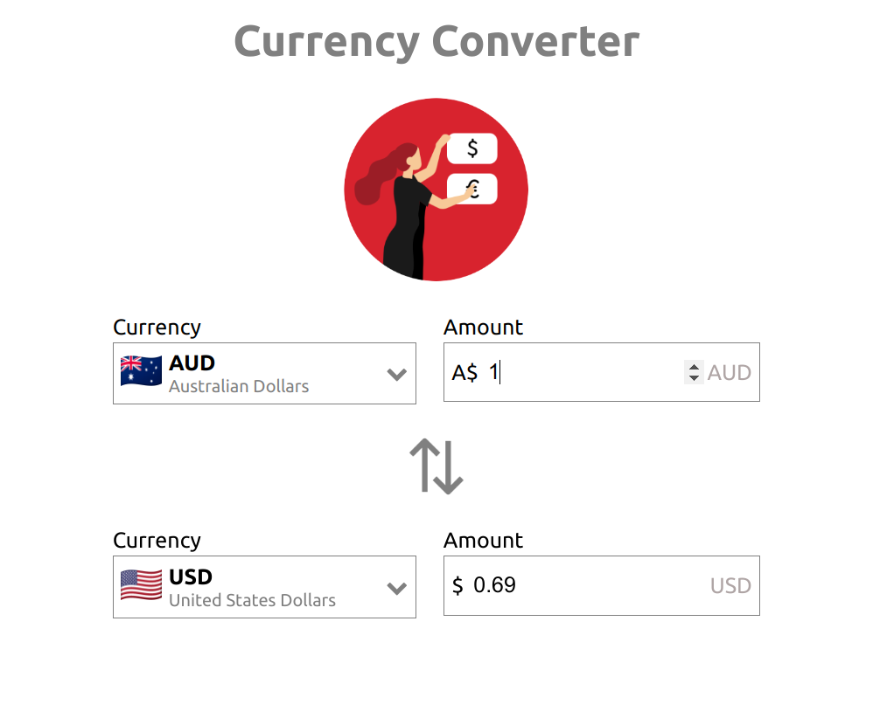

# Currency Converter
This application converts different currencies to any chosen one.
## Built With

- Typescript
- React
- JavaScript
- Jest
- Axios

## Screenshot

## Live Demo

[Live Demo Link](https://henrykc24.github.io/React-Typescript-Todo-App/)

## Getting Started

To get a local copy up and running follow these simple example steps in the command line:

1. Clone the repo: `git clone https://github.com/HENRYKC24/currency-converter-client.git`

2. Go to the project folder: `cd currency-converter-client`

3. Install dependencies: `yarn install`

4. Start application locally: `yarn start`

## Author

👤 **Henry Kc**

- GitHub: [@githubhandle](https://github.com/henrykc24)
- Twitter: [@twitterhandle](https://twitter.com/henrykc24)
- LinkedIn: [LinkedIn](https://linkedin.com/in/henry-kc)

## 🤝 Contributing

Contributions, issues, and feature requests are welcome!

Feel free to check the [issues page](https://github.com/HENRYKC24/currency-converter-client/issues/).

## Show your support

Give a ⭐️ if you like this project!

## Acknowledgments

- Special thanks to every software developer whose code was used in this application.

## 📝 License

This project is [MIT](./LICENSE) licensed.
